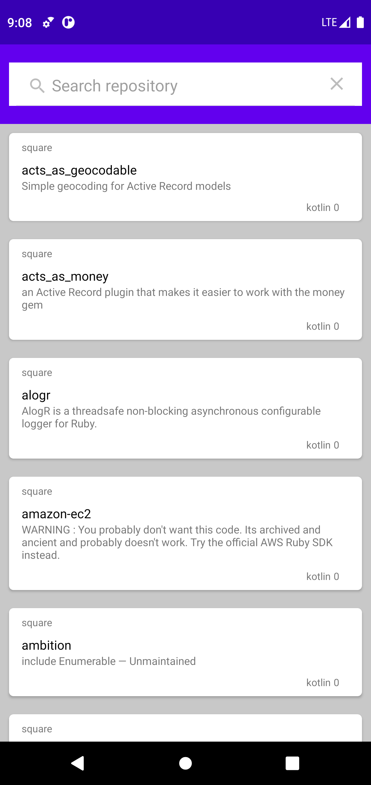
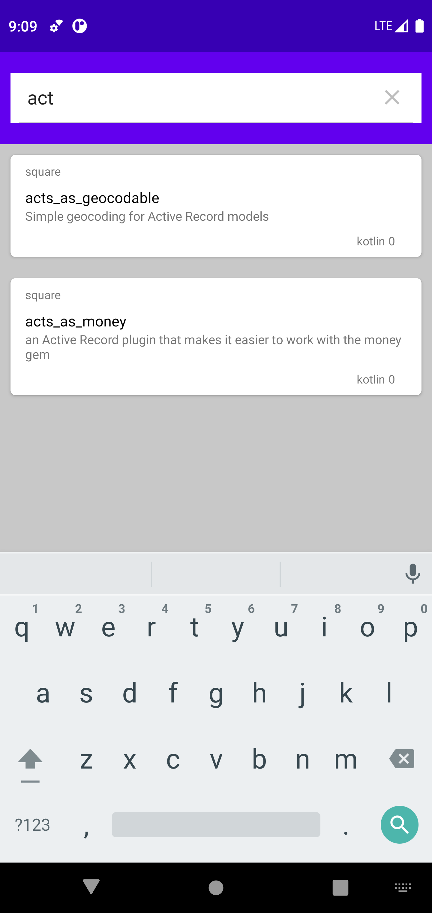
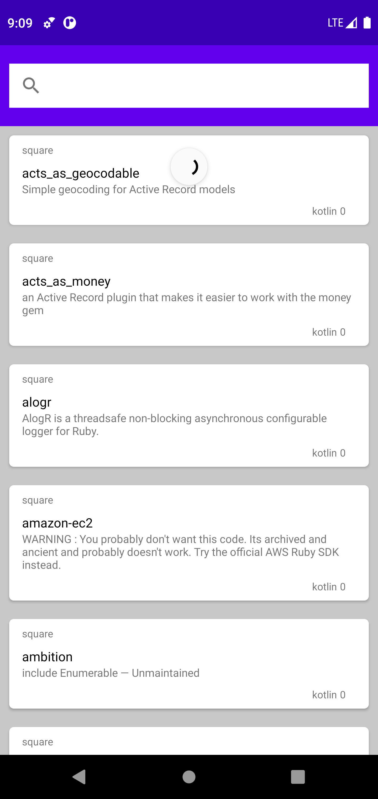
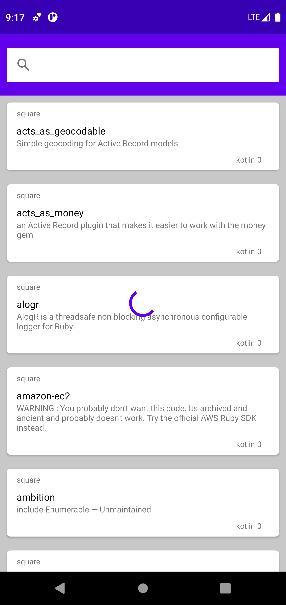

# repository
Repository app is the app which give you  the list of all public repositories  ,with relevant  details .

<b>COMPONENTS USED</b>

1.MVVM architecture -one of the architectural patterns which enhances separation of concerns, it allows separating the user interface logic from the business (or the back-end) logic.it's mainly used for long-term project

2.JetPack architecture - is a suite of libraries, tools, and guidance to help developers write high-quality apps more easily.

3.Kotlin Co-routine-contains a number of high-level coroutine-enabled primitives that this guide covers, including launch, async and others

4.ROOM Library -  Storing data in internal database 

5.koin -A light weight Framework for dependency injection

6.DataBinding -allows you to bind UI components in your layouts to data sources in your app using a declarative format rather than programmatically.

<b>SCREENSHOTS</b> 

